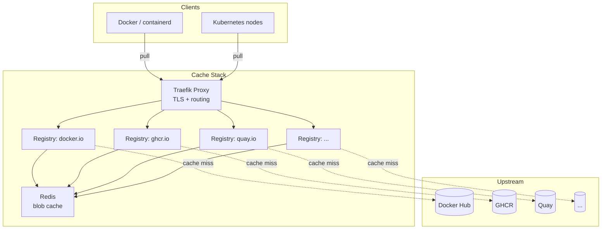

# Multi-Registry Pull Through Cache 🚀


Generate a complete Docker Compose stack with pull-through caches for multiple container registries, fronted by Traefik and accelerated by Redis.

> **⚠️ Migrating from the script-based version?** See the [upgrade guide](docs/upgrading.md). TL;DR: `python setup.py` → `multi-registry-cache setup`, `python generate.py` → `multi-registry-cache generate`. Your existing `config.yaml` and Docker usage are **fully compatible**.

---



---

## 🚀 Features

| Feature | Description |
| --- | --- |
| 🏗️ **Multi-Registry** | Mirror Docker Hub, GHCR, Quay, NVCR, or any OCI registry |
| 🔒 **Private Registry** | Add a private registry alongside your caches |
| 🌐 **Traefik Proxy** | Automatic TLS termination and subdomain-based routing |
| ⚡ **Redis Acceleration** | Blob descriptor caching for faster repeated pulls |
| 🧙 **Interactive Wizard** | Guided `setup` command to generate your `config.yaml` |
| 📦 **Installable CLI** | `uvx`, `pipx`, `pip install`, or Docker — your choice |
| ☸️ **K8s Ready** | Works with k3s, RKE2, containerd, dockerd |
| 🗄️ **Flexible Storage** | Filesystem, S3, GCS, or in-memory backends |
| 🔧 **Customizable** | Full control over Traefik, registry, and Compose config via `{name}` interpolation |
| 🌱 **Eco-Friendly** | Less external bandwidth = smaller carbon footprint |

---

## 📦 Installation

### With uvx (recommended, zero install)

```bash
uvx multi-registry-cache setup
uvx multi-registry-cache generate
```

### With uv tool / pipx

```bash
uv tool install multi-registry-cache   # or: pipx install multi-registry-cache
multi-registry-cache setup
multi-registry-cache generate
```

### With pip

```bash
pip install multi-registry-cache
```

### With Docker

```bash
touch config.yaml
docker run --rm -ti -v "./config.yaml:/app/config.yaml" obeoneorg/multi-registry-cache setup
docker run --rm -ti -v "./config.yaml:/app/config.yaml" -v "./compose:/app/compose" obeoneorg/multi-registry-cache generate
```

---

## 🛠️ Quick Start


### 1. Run the interactive wizard

```bash
multi-registry-cache setup
```

### 2. Review & fine-tune

Edit `config.yaml` for advanced settings (TLS, Let's Encrypt, storage backends, etc.). See [docs/configuration.md](docs/configuration.md) for details.

### 3. Generate the stack

```bash
multi-registry-cache generate
```

### 4. Launch

```bash
cd compose && docker compose up -d
```

---

## ⚙️ CLI Reference

| Command | Description |
| --- | --- |
| `multi-registry-cache setup` | Interactive wizard → `config.yaml` |
| `multi-registry-cache generate` | Read `config.yaml` → generate `compose/` |
| `multi-registry-cache --help` | Show all commands |

| Option | Applies to | Default | Description |
| --- | --- | --- | --- |
| `--config`, `-c` | `setup`, `generate` | `config.yaml` | Config file path |
| `--output-dir`, `-o` | `generate` | `compose` | Output directory |

---

## 🔄 Configuring Container Runtimes

### containerd

```toml
[plugins."io.containerd.grpc.v1.cri".registry.mirrors]
  [plugins."io.containerd.grpc.v1.cri".registry.mirrors."docker.io"]
    endpoint = ["https://dockerhub.registry-cache.example.net"]
  [plugins."io.containerd.grpc.v1.cri".registry.mirrors."ghcr.io"]
    endpoint = ["https://ghcr.registry-cache.example.net"]
```

```bash
sudo systemctl restart containerd
```

### nerdctl

```bash
mkdir -p /etc/containerd/certs.d/docker.io/
```

`/etc/containerd/certs.d/docker.io/hosts.toml`:

```toml
server = "https://docker.io"

[host."https://dockerhub.registry-cache.example.net"]
  capabilities = ["pull", "resolve"]
```

### dockerd

```json
{
  "registry-mirrors": ["https://dockerhub.registry-cache.example.net"]
}
```

```bash
sudo systemctl daemon-reload && sudo systemctl restart docker
```

### k3s / RKE2

`/etc/rancher/(k3s|rke2)/registries.yaml`:

```yaml
mirrors:
  docker.io:
    endpoint:
      - https://dockerhub.registry-cache.example.net
  ghcr.io:
    endpoint:
      - https://ghcr.registry-cache.example.net
```

### BuildKit

BuildKit resolves images independently from dockerd. Without explicit configuration, `docker build` will **not** use your registry mirrors.

Create a `buildkitd.toml` with your mirrors:

```toml
[registry."docker.io"]
  mirrors = ["dockerhub.registry-cache.example.net"]

[registry."ghcr.io"]
  mirrors = ["ghcr.registry-cache.example.net"]

[registry."dockerhub.registry-cache.example.net"]
  http = false
  # ca = ["/etc/certs/my-ca.pem"]  # if using a private CA

[registry."ghcr.registry-cache.example.net"]
  http = false
```

Where to place this file depends on your setup:

| Context | Config path |
| --- | --- |
| Docker Engine (rootful) | `/etc/buildkit/buildkitd.toml` |
| Docker Engine (rootless) | `~/.config/buildkit/buildkitd.toml` |
| buildx auto-detection | `~/.docker/buildx/buildkitd.default.toml` |
| Docker Desktop default builder | **Not supported** (see below) |

> **Docker Desktop**: the default builder uses the `docker` driver, which does **not** support `buildkitd.toml`. You must create a separate builder with the `docker-container` driver:
>
> ```bash
> docker buildx create --use --bootstrap \
>   --name cached-builder \
>   --driver docker-container \
>   --buildkitd-config /path/to/buildkitd.toml
> ```

### Other Kubernetes distributions

Configure each node's container runtime to use the registry mirror. Refer to your distribution's documentation.

---

## 📚 Documentation

Full documentation is available in the [`docs/`](docs/) folder:

| Page | Description |
| --- | --- |
| [Architecture](docs/architecture.md) | Data flow, interpolation system, Redis DB assignment |
| [Configuration](docs/configuration.md) | Complete `config.yaml` reference |
| [CLI reference](docs/cli.md) | All commands, options, shell completion |
| [Storage backends](docs/storage-backends.md) | inmemory, filesystem, S3, GCS |
| [TLS & SSL](docs/tls-ssl.md) | Let's Encrypt, ACME, BYO cert, HTTP-only |
| [Runtime configuration](docs/runtime-configuration.md) | containerd, dockerd, k3s, BuildKit |
| [Internals](docs/internals.md) | Source code walkthrough, running tests |
| [Contributing](docs/contributing.md) | Dev setup, commit conventions, PR process |
| [Upgrading to v2.0.0](docs/upgrading.md) | Migrate from the old script-based version |

---

## 📄 License

MIT — [Grégoire Compagnon](https://github.com/obeone)

---

Contributions welcome! Open an [issue](https://github.com/obeone/multi-registry-cache/issues) or submit a PR. 🐋
