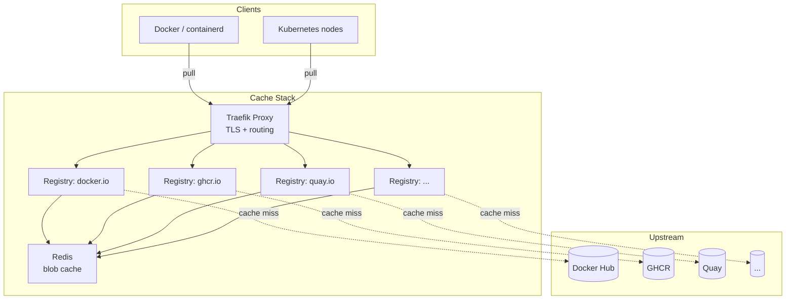

# Multi-Registry Pull Through Cache 🚀


Generate a complete Docker Compose stack with pull-through caches for multiple container registries, fronted by Traefik and accelerated by Redis.

> **⚠️ Migrating from v1.x scripts?** See the [upgrade guide](docs/upgrading.md).
> TL;DR: `python setup.py` → `multi-registry-cache setup`, `python generate.py` → `multi-registry-cache generate`.
> Your `config.yaml` and Docker usage are **fully compatible**.

---



---

## 🚀 Features

| Feature | Description |
| --- | --- |
| 🏗️ **Multi-Registry** | Mirror Docker Hub, GHCR, Quay, NVCR, or any OCI registry |
| 🔒 **Private Registry** | Add a standalone private registry alongside your caches |
| 🌐 **Traefik Proxy** | Automatic TLS termination and subdomain-based routing |
| ⚡ **Redis Acceleration** | Blob descriptor caching for faster repeated pulls |
| 🧙 **Interactive Wizard** | Guided `setup` command to generate your `config.yaml` |
| 📦 **Installable CLI** | `uvx`, `pipx`, `pip install`, or Docker — your choice |
| ☸️ **K8s Ready** | Works with k3s, RKE2, containerd, dockerd |
| 🗄️ **Flexible Storage** | Filesystem, S3, GCS, or in-memory backends |
| 🔧 **Customizable** | Full control over Traefik, registry, and Compose config via `{name}` interpolation |
| 🌱 **Eco-Friendly** | Less external bandwidth = smaller carbon footprint |

---

## 📦 Installation

| Method | Command |
| --- | --- |
| **uvx** (zero install) | `uvx multi-registry-cache setup` |
| **uv tool** | `uv tool install multi-registry-cache` |
| **pipx** | `pipx install multi-registry-cache` |
| **pip** | `pip install multi-registry-cache` |
| **Docker** | See below |

```bash
# Docker — interactive setup
docker run --rm -ti -v "./config.yaml:/app/config.yaml" obeoneorg/multi-registry-cache setup

# Docker — generate compose/ from an existing config.yaml
docker run --rm -v "./config.yaml:/app/config.yaml" -v "./compose:/app/compose" obeoneorg/multi-registry-cache generate
```

---

## 🛠️ Quick Start


```bash
# 1. Create config interactively
multi-registry-cache setup

# 2. Fine-tune config.yaml (TLS, storage, hostnames…)
# See docs/configuration.md

# 3. Generate the stack
multi-registry-cache generate

# 4. Start
cd compose && docker compose up -d
```

---

## ⚙️ CLI Reference

| Command | Description |
| --- | --- |
| `multi-registry-cache setup [--config PATH]` | Interactive wizard → `config.yaml` |
| `multi-registry-cache generate [--config PATH] [--output-dir DIR]` | Read config → generate `compose/` |
| `multi-registry-cache completion [zsh\|bash\|fish]` | Print shell completion script |
| `multi-registry-cache --help` | Show all commands |

---

## 🔄 Configuring Container Runtimes

Point your container runtime at the cache after deploying the stack. Quick examples below — see [docs/runtime-configuration.md](docs/runtime-configuration.md) for full instructions (nerdctl, RKE2, BuildKit, Docker Desktop…).

### containerd

```toml
# /etc/containerd/config.toml
[plugins."io.containerd.grpc.v1.cri".registry.mirrors]
  [plugins."io.containerd.grpc.v1.cri".registry.mirrors."docker.io"]
    endpoint = ["https://dockerhub.registry-cache.example.net"]
  [plugins."io.containerd.grpc.v1.cri".registry.mirrors."ghcr.io"]
    endpoint = ["https://ghcr.registry-cache.example.net"]
```

```bash
sudo systemctl restart containerd
```

### dockerd

```json
{ "registry-mirrors": ["https://dockerhub.registry-cache.example.net"] }
```

```bash
sudo systemctl daemon-reload && sudo systemctl restart docker
```

### k3s / RKE2

```yaml
# /etc/rancher/k3s/registries.yaml
mirrors:
  docker.io:
    endpoint: ["https://dockerhub.registry-cache.example.net"]
  ghcr.io:
    endpoint: ["https://ghcr.registry-cache.example.net"]
```

---

## 📚 Documentation

| Page | Description |
| --- | --- |
| [Architecture](docs/architecture.md) | Data flow, interpolation system, Redis DB assignment |
| [Configuration](docs/configuration.md) | Complete `config.yaml` reference |
| [CLI reference](docs/cli.md) | All commands, options, shell completion |
| [Storage backends](docs/storage-backends.md) | inmemory, filesystem, S3, GCS |
| [TLS & SSL](docs/tls-ssl.md) | Let's Encrypt, ACME, BYO cert, HTTP-only |
| [Runtime configuration](docs/runtime-configuration.md) | containerd, dockerd, k3s, BuildKit |
| [Internals](docs/internals.md) | Source code walkthrough, running tests |
| [Contributing](docs/contributing.md) | Dev setup, commit conventions, PR process |
| [Upgrading to v2.0.0](docs/upgrading.md) | Migrate from the old script-based version |

---

## 📄 License

MIT — [Grégoire Compagnon](https://github.com/obeone)

---

Contributions welcome! Open an [issue](https://github.com/obeone/multi-registry-cache/issues) or submit a PR. 🐋
