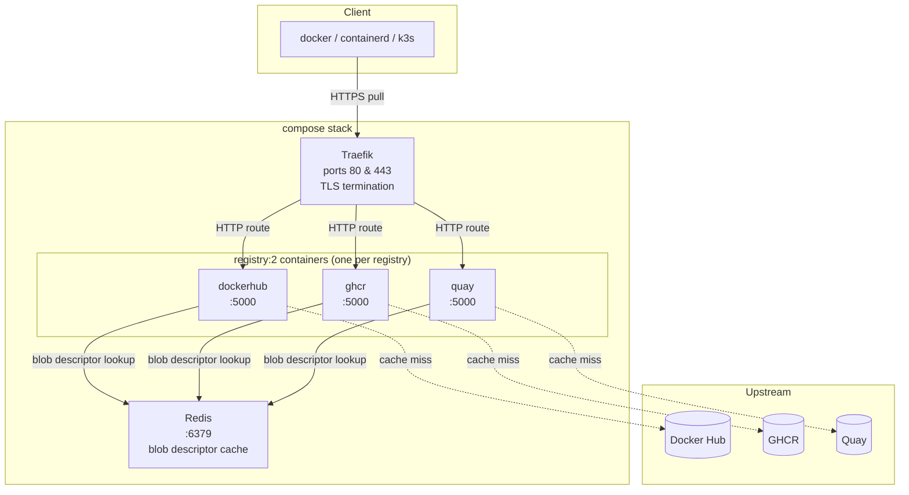
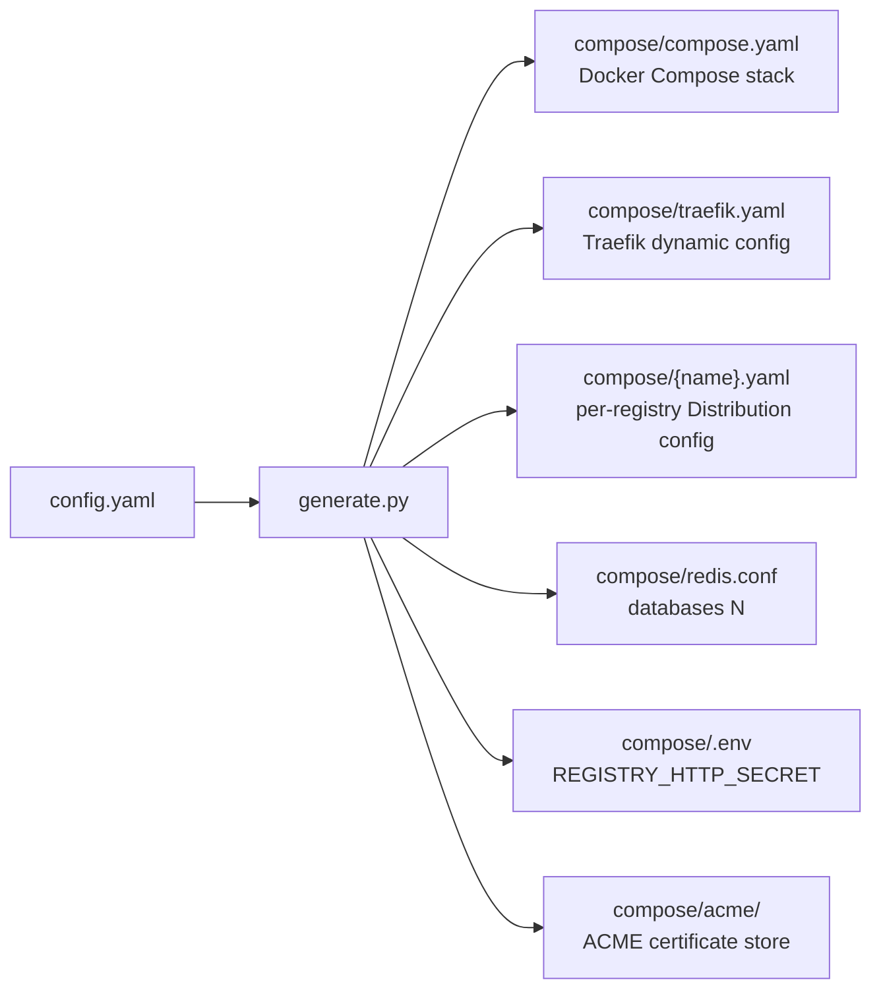

# Architecture

## Runtime architecture

At runtime the stack consists of four kinds of containers orchestrated by Docker Compose:



- **Traefik** listens on 80/443 and routes requests by hostname to the correct `registry:2` container using rules defined in `traefik.yaml`.
- Each **registry:2** container runs the [Distribution](https://distribution.github.io/distribution/) server. For cache-type registries it is configured as a pull-through proxy (`proxy.remoteurl`). For `registry`-type entries the proxy block is absent and the container acts as a standalone registry.
- **Redis** stores blob descriptors shared across all registries. Each registry uses a dedicated database number (0, 1, 2, …) within the same Redis instance.

---

## Config-to-output flow



The generator (`src/multi_registry_cache/generate.py`) performs these steps for each registry:

1. Deep-copy the base registry config from `config.yaml`.
2. Call `create_registry_config()` — sets `proxy.remoteurl` for cache types, removes the `proxy` block for `registry` types, assigns the Redis DB number, then runs string interpolation.
3. Write `compose/{name}.yaml`.
4. Strip the `password` field from the registry dict (prevents secrets leaking into Compose/Traefik files).
5. Call `create_docker_service()` and `create_traefik_router()` / `create_traefik_service()` — apply per-registry templates from `config.yaml` with string interpolation, merge into the running `docker_config` / `traefik_config` dicts.
6. Increment the Redis DB counter.

After iterating all registries it writes `compose.yaml`, `traefik.yaml`, `redis.conf` (with `databases N`), and `compose/.env` (with `REGISTRY_HTTP_SECRET` if absent).

---

## String interpolation

`functions.interpolate_strings(obj, variables)` recursively walks any combination of `dict`, `list`, and `str` and calls Python's `str.format_map(variables)` on every string leaf.

The `variables` dict is built from the registry entry in `config.yaml`. All fields present in a registry are available as placeholders:

| Placeholder | Source field | Typical value |
| --- | --- | --- |
| `{name}` | `registries[].name` | `dockerhub` |
| `{url}` | `registries[].url` | `https://registry-1.docker.io` |
| `{username}` | `registries[].username` | `myuser` |
| `{password}` | `registries[].password` | *(stripped before compose/traefik interpolation)* |
| `{ttl}` | `registries[].ttl` | `720h` |

Any extra field added to a registry entry is automatically available as a placeholder.

**Example** — the per-registry Traefik router rule in `config.yaml`:

```yaml
traefik:
  perRegistry:
    router:
      rule: "Host(`{name}.registry-cache.example.net`)"
```

For the registry named `dockerhub` this becomes:

```yaml
rule: "Host(`dockerhub.registry-cache.example.net`)"
```

---

## Registry types

| `type` field | Behaviour |
| --- | --- |
| `cache` | `proxy.remoteurl` is set to the registry URL; credentials and TTL are added if present |
| `registry` | The entire `proxy` block is removed from the Distribution config |

The `type` field was introduced in v2.0.0. If absent it defaults to `cache` (backward compatibility).

---

## Redis database assignment

The generator maintains a counter (`count_redis_db`) starting at 0. After writing each registry's config file the counter is incremented. The final value is written to `redis.conf` as `databases N`, telling Redis to pre-allocate the correct number of databases.

```text
Registry index 0 → db 0
Registry index 1 → db 1
...
Registry index N-1 → db N-1
redis.conf → databases N
```

This assignment is **positional** — reordering registries in `config.yaml` changes their DB numbers and invalidates cached blob descriptors. Always regenerate and restart the stack after reordering.

---

## Password handling

The `password` field is written to the per-registry Distribution config (used by the pull-through proxy to authenticate against the upstream registry). It is then **removed** from the in-memory registry dict before the Compose and Traefik interpolation steps. This prevents credentials from appearing in `compose.yaml` or `traefik.yaml`.

---

## ACME directory

The generator creates `compose/acme/` unconditionally. Traefik writes Let's Encrypt certificates there when ACME is configured. The directory must exist before Traefik starts, which is why it is created at generation time even if TLS is not yet enabled.
