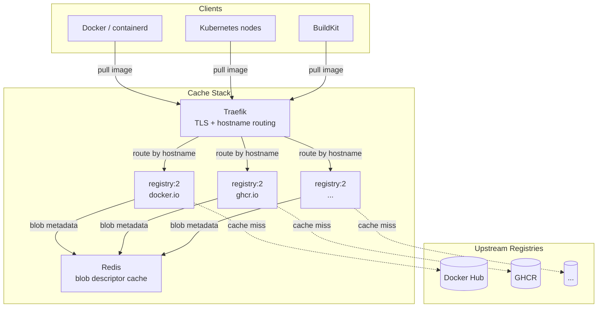

# Documentation — multi-registry-cache

Generate a complete Docker Compose stack that acts as pull-through cache for multiple container registries (Docker Hub, GHCR, Quay, NVCR, …), fronted by Traefik and accelerated by Redis blob caching.

---

## Where to start

| I want to… | Go to |
| --- | --- |
| Understand how everything fits together | [Architecture](architecture.md) |
| Configure registries, storage, Traefik, TLS | [Configuration reference](configuration.md) |
| Use the CLI or Docker image | [CLI reference](cli.md) |
| Choose a storage backend (S3, GCS, filesystem…) | [Storage backends](storage-backends.md) |
| Set up HTTPS / Let's Encrypt | [TLS & SSL](tls-ssl.md) |
| Point Docker / containerd / k3s at the cache | [Runtime configuration](runtime-configuration.md) |
| Read the source code or run tests | [Internals & developer guide](internals.md) |
| Contribute a fix or feature | [Contributing](contributing.md) |

---

## Overview

The tool generates configuration files from a single `config.yaml`. It does **not** run the stack itself — `docker compose up -d` does that.

---

## Quick links

- [GitHub repository](https://github.com/obeone/multi-registry-cache)
- [PyPI package](https://pypi.org/project/multi-registry-cache/)
- [Docker Hub image](https://hub.docker.com/r/obeoneorg/multi-registry-cache)
- [Issue tracker](https://github.com/obeone/multi-registry-cache/issues)
